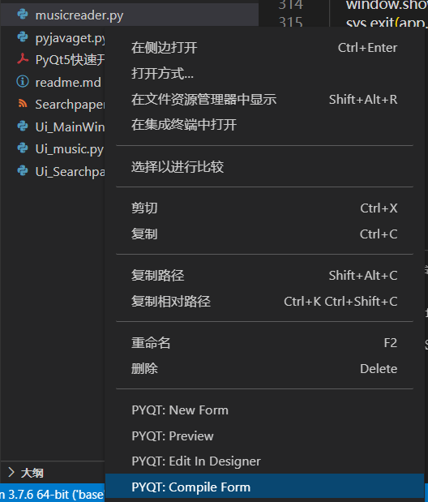

# 目前不足：

#### 1.无法自动切换下一首

#### 2.无法收藏（似乎没必要）

#### ~~3.运行缓慢，需要加入多线程~~

#### ~~4.没有加载动画~~

#### ~~5.无法下载歌曲~~

#### 6.自定义下载路径

#### 7.导入本地歌曲

## ui文件需要vscode插件（pyqt intergration）进行编译为py文件

## pyuic5 UI.ui -o UI.py

## 

## 1.

### QQ音乐搜索需要安装musicreader里的解码器

## 2.

### python需要selenium支持

### #pip install selenium

## 驱动下载地址

```
chrome
https://chromedriver.storage.googleapis.com/index.html 
edge
https://developer.microsoft.com/en-us/microsoft-edge/tools/webdriver/
```


### #down chromedriver.exe对应版本

## 3.

### python需要PyQt5支持

### 安装可能需要3.8

### pip install PyQt5

### pip install PyQt5-tools

### 安装过程中可能需要安装高版本py插件

### 安装完后有designer

## 4.

```
import Ui_MainWindow
from PyQt5.QtWidgets import QMainWindow
import sys
from PyQt5 import QtWidgets
from PyQt5.QtCore import Qt

class mainwindow(Ui_MainWindow.Ui_MainWindow,QMainWindow):
    def __init__(self):
        super().__init__()
        self.setupUi(self)
        self._initUI()

    def _initUI(self):
        self.setWindowFlags(Qt.FramelessWindowHint)  # 无边框


if __name__ == '__main__':
    app = QtWidgets.QApplication(sys.argv)
    window=mainwindow()
    window.show() 
    sys.exit(app.exec_())
```

## 使用以上导入并运行一个由ui文件布局的主窗口模式的py


